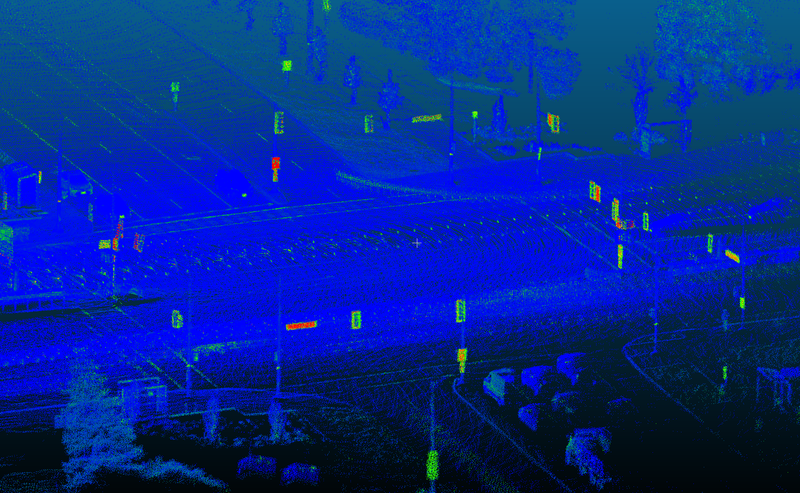

# leslie_lidar_mapping
This repo contains code for creating a 3D lidar map of Leslie and Highway 7.

## Leslie Street and Highway 7 (Markham, Ontario)



## Programs

`mapping.cpp` This program uses an initial guess from GPS with lidar-based iterative closest point (ICP) to refine the registration and incrementally build a map. Octree downsampling is used to keep the size of the map manageable.

`odometry.cpp` This program performs lidar odometry and saves the results to a csv file.

`batch_optimize_poses.cpp` Using ICP results in fine-grained registration but tends to drift at around 1% of traveled distance. This program is an attempt to combat this by constructing a pose graph and performing a pose graph relaxation between the absolute pose measurements from GPS and the relative pose measurements from lidar-based ICP.

`ray_tracing.cpp` This program compares each keyframe against the raw map and performs ray-tracing in order to calculate the probability of each point being a part of the short-term-movable class. The goal of this program is to remove moving objects (vehicles, pedestrians) that were observed during the mapping process. This code is mostly copied from [Hugues Thomas' work on self-supervised lidar segmentation](https://arxiv.org/abs/2012.05897v1).

## Build Instructions

These build instructions assume catkin tools are being used to build the repo.
These instructions have only been tested on Ubuntu 16.04 but should work with newer versions of Ubuntu (with some minor fixes).

Dependencies:

```
libnabo
libpointmatcher
Eigen 3.3
OpenCV 3.3
steam
```

Installing libnabo:

```
git clone https://github.com/ethz-asl/libnabo.git
cd libnabo && mkdir build && cd build && cmake .. && make && make install
```

Installing libpointmatcher:

```
git clone https://github.com/ethz-asl/libpointmatcher.git
cd libpointmatcher && mkdir build && cd build && cmake .. && make && make install
```

Installing steam:

```
mkdir \~/steam_ws && cd \~steam_ws
git clone https://github.com/utiasASRL/steam.git
cd steam && git submodule update --init --remote
cd deps/catkin && catkin build && cd ../.. && catkin build
```

Building this repo:

```
mkdir -p \~/map_ws/src/ && cd \~/map_ws/src
git clone https://github.com/keenan-burnett/leslie_mapping.git
cd ../.. && catkin init && catkin config --extend \~/steam_ws/devel/repo && catkin build
```

## TODO Items

- [ ] Use T_map_sensor after ICP to store keyframe locations instead of the raw GPS position.
- [ ] Try increasing / decreasing K (number of keyframes used) and observed impact on performance.
- [ ] Use pose output from Applanix lidar localization and test the registration performance without ICP.
